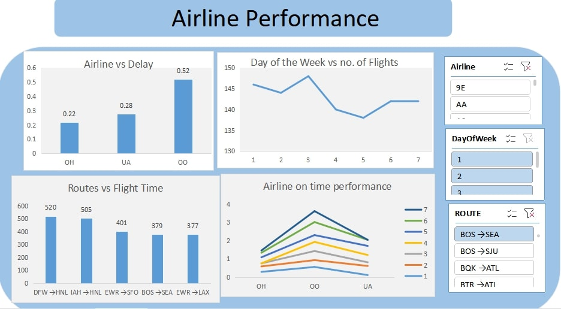

# Airlines Perfomance

# Overview
This project focuses on analyzing flight data to uncover operational inefficiencies and support strategic decision-making within the airline industry. I aim to answer key 
business questions:

## Key Business Questions
1. Which airlines have the lowest average delays overall?
2. What is the busiest day of the week for flights?
3. Which airport routes have the longest total flight time?
4. Which airlines have the most consistent on-time performance across different days of the week?

By answering this questions, my project seeks to enhance service reliability, optimize scheduling, and improve overall customer satisfaction.

## Stakeholders
The insights from this analysis are valuable to stakeholders in the aviation industry including:
- Aircraft operators
- Aircraft regulatory authorities
- Customer Experience Teams

# Data Understanding and Analysis
## Source of Data
The dataset in this repository is from [Kaggle](https://www.kaggle.com/datasets/jimschacko/airlines-dataset-to-predict-a-delay). 

I did a sample of 1000 rows for my analysis. I used 9 columns, which included variables about:
- `id`: Serial No
- `Airline`: Different types of commercial airlines
- `Flight`: Types of Aircraft
- `AirportFrom`: Source Airport
- `AirportTo`: Destination Airport
- `DayOfWeek`: Tells you about the day of week
- `Time`: Time taken. 
- `Length`: Length
- `Delay`: Whether the flight is delayed or not.
- `Route`: concatenation of `AirportFrom` and `AirportTo`

# Results

# Conclusion

# Next Steps

# For more information
Explore more on this Dashboard

# Repository Structure

