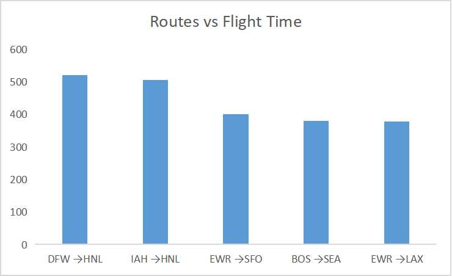

# Airlines Perfomance

# Overview
This project focuses on analyzing flight data to uncover operational inefficiencies and support strategic decision-making within the airline industry. I aim to answer key 
business questions:

## Key Business Questions
1. Which airlines have the lowest average delays overall?
2. What is the busiest day of the week for flights?
3. Which airport routes have the longest total flight time?
4. Which airlines have the most consistent on-time performance across different days of the week?

By answering this questions, my project seeks to enhance service reliability, optimize scheduling, and improve overall customer satisfaction.

## Stakeholders
The insights from this analysis are valuable to stakeholders in the aviation industry including:
- Aircraft operators
- Aircraft regulatory authorities
- Customer Experience Teams

# Data Understanding and Analysis
## Source of Data
The dataset in this repository is from [Kaggle](https://www.kaggle.com/datasets/jimschacko/airlines-dataset-to-predict-a-delay). 

I did a sample of 1000 rows for my analysis. I used 9 columns, which included variables about:
- `id`: Serial No
- `Airline`: Different types of commercial airlines
- `Flight`: Types of Aircraft
- `AirportFrom`: Source Airport
- `AirportTo`: Destination Airport
- `DayOfWeek`: Tells you about the day of week
- `Time`: Time taken. 
- `Length`: Length
- `Delay`: Whether the flight is delayed or not.
- `Route`: concatenation of `AirportFrom` and `AirportTo`

# Results
- Alaska Airlines(AS),OH and YV have the lowest average delays.                      

- 3rd, 1st, and 2nd days of the week are the busiest.

- The airport routes DFW→HNL,IAH→HNL and EWR→SFO have the longest total flight time

- OH, OO and UA have the most consistent on-time performance.

# Conclusion
From the analysis of airline delay, flight frequency, and route duration data:

- Airlines with the Lowest Delays:
Alaska Airlines (AS), OH, and YV stand out for their low average delays, suggesting strong operational efficiency or favorable route selections.

- Busiest Days of the Week:
The 1st (Monday), 2nd (Tuesday), and 3rd (Wednesday) days of the week experience the highest flight volumes. This trend may reflect typical business travel patterns early in the week.

- Longest Flight Routes:
The routes from DFW → HNL, IAH → HNL, and EWR → SFO have the longest total flight times, likely due to long-haul distances and potential layover durations or air traffic.

- Consistent On-Time Performance:
Airlines OH, OO, and UA demonstrate the most reliable on-time performance, indicating better schedule adherence and potentially fewer weather- or congestion-related delays.

# Next Steps
- Incorporate Weather & Seasonal Data
Add weather conditions and seasonal trends to understand their impact on delays and flight volumes.

- Drill into Delay Types
Break down delays by cause (e.g., carrier, weather, security, late aircraft) to identify specific areas for improvement.

- Passenger Impact Analysis
Combine with passenger volume data to assess how delays affect customer satisfaction and revenue.

- Route Optimization Insights
Use flight time data to recommend more efficient routing or scheduling strategies for airlines with consistent delays.

- Predictive Modeling
Develop a machine learning model to predict flight delays based on day, time, airline, and route characteristics.

# For more information
Explore more on this Dashboard

# Repository Structure

